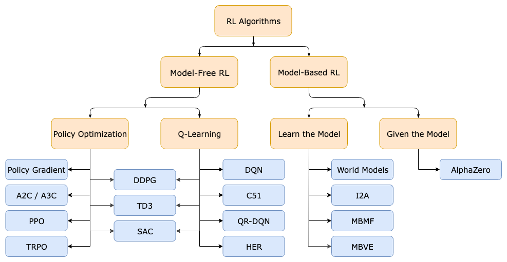

# Reinforcement Learning

Learning Roadmap

1. basics
2. papers

## Learning Resources

1. OpenAI Spinning Up

[Introduction — Spinning Up  documentation](https://spinningup.openai.com/en/latest/user/introduction.html)

1. Bilibili Videos

## RL algorithms

---

[RL Concepts](https://www.notion.so/RL-Concepts-c16e19f04e094e51b676a4f06e1730a1?pvs=21)

[Vanilla Policy Gradient](https://www.notion.so/Vanilla-Policy-Gradient-26aed747a22644a2a3d18012b23e9e7d?pvs=21)

[Trust Region Policy Optimization](https://www.notion.so/Trust-Region-Policy-Optimization-12ae36a97d9949e4ae259caadfb810e2?pvs=21)
